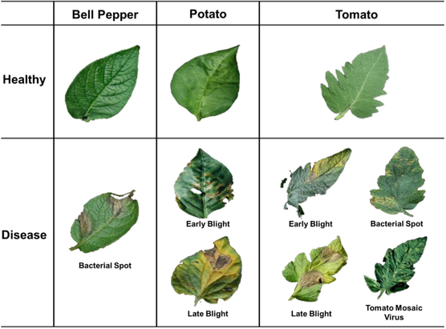
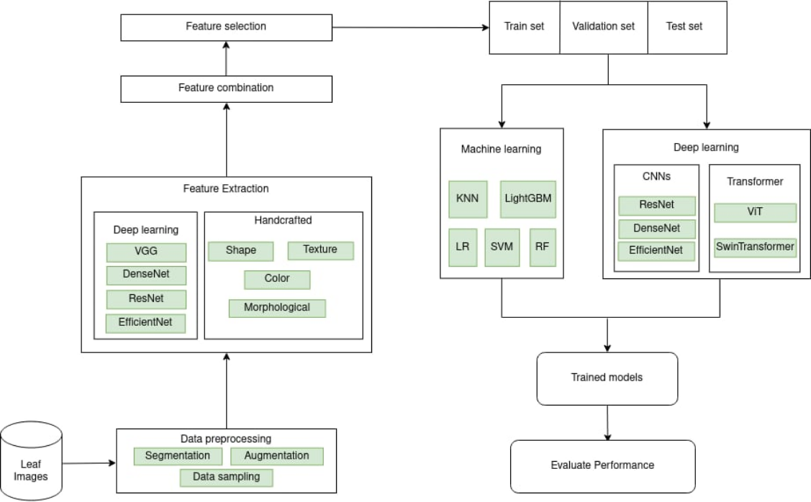
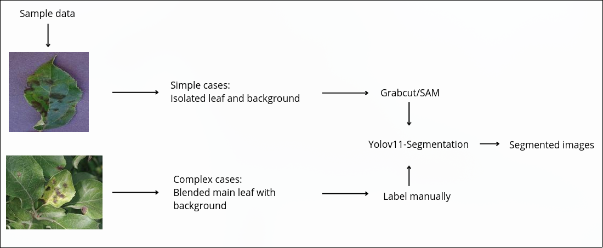

# LeafNet

Plant leaf disease classification project developed for **Research Connect 2025**, where our team advanced to the **Top 12 Finalists**.

**Role:** Team Leader / AI Engineer  
**Team size:** 5

LeafNet compares three levels of visual learning for plant disease recognition:

1. **Handcrafted features + classical machine learning**
2. **Pretrained deep features + classical classifiers**
3. **End-to-end CNN and Vision Transformer models**

The goal was not only to maximize classification accuracy, but also to compare how representation learning changes performance across increasingly complex approaches.

<p align="center">
  
</p>

<p align="center"><i>Representative leaf-disease examples used in the LeafNet workflow.</i></p>

## Project Overview

The project covers leaf segmentation, feature engineering, classical machine learning, transfer-based deep feature extraction, and end-to-end deep learning.

### Overall Workflow

<p align="center">
  
</p>

<p align="center"><i>LeafNet workflow from image preprocessing and segmentation to feature-based and end-to-end classification.</i></p>

The experimental design progresses from interpretable handcrafted representations to learned deep features and finally fully end-to-end CNN/Transformer models. This makes it possible to compare not only model families, but also how the choice of representation affects classification performance.

## Results

The original experiments show a clear progression across the three stages:

| Approach | Representative best result |
|---|---:|
| Handcrafted features + classical ML | ~87% accuracy |
| Deep features + classical ML | ~91% accuracy |
| End-to-end CNN / Transformer | **95.70% accuracy** |

The consolidated end-to-end comparison is available in [`results/model_comparison.csv`](results/model_comparison.csv).

| Model | Test Accuracy | Weighted F1 |
|---|---:|---:|
| DenseNet201 | **95.70%** | **95.55%** |
| ResNet50V2 | 92.39% | 91.88% |
| Swin Transformer | 92.29% | 91.93% |
| EfficientNet-B0 | 92.37% | 92.57% |
| ResNet50 | 92.22% | 92.42% |
| ViT | 92.09% | 91.57% |
| ResNet101 | 91.77% | 91.92% |

These values are tracked experiment results from the original project notebooks rather than a claim that every experimental setup reaches the same performance.

## Experimental Stages

### 0. Leaf Segmentation and Preprocessing

Before classification, the project explored leaf-region segmentation and preprocessing to isolate useful visual information from the input image.

<p align="center">
  
</p>

<p align="center"><i>Segmentation and preprocessing pipeline used in the LeafNet experiments.</i></p>

The corresponding notebook is available at [`experiments/00_leaf_segmentation/segmentation.ipynb`](experiments/00_leaf_segmentation/segmentation.ipynb).

### 1. Handcrafted Features + Classical ML

The first classification stage establishes classical baselines using manually extracted image features and models such as Logistic Regression, SVM, KNN, Random Forest, and LightGBM.

### 2. Deep Features + Classical ML

Pretrained CNN backbones are used as feature extractors. DenseNet201, ResNet50, EfficientNet-B0, and VGG19 representations are evaluated with classical classifiers, including PCA-based variants.

### 3. End-to-End Deep Learning

The final stage trains and compares CNN and Transformer families directly for disease classification. Architectures explored include DenseNet201, ResNet50/101, ResNet50V2, EfficientNet-B0, ViT, and Swin Transformer.

## Repository Structure

```text
LeafNet/
├── assets/
│   ├── figures/
│   │   ├── leaf_examples.png
│   │   ├── leafnet_workflow.png
│   │   └── segmentation_pipeline.png
│   └── demo_samples/             # Example images used by the prototype
├── artifacts/
│   └── feature_matrices/         # Large generated feature artifacts
├── data/
│   └── class_description.json    # Disease metadata used by the demo
├── demo/
│   ├── app.py                    # Flask inference prototype
│   ├── templates/
│   └── archive/                  # Earlier demo/database experiments
├── docs/
│   ├── competition/              # Research Connect material
│   └── methodology.md
├── experiments/
│   ├── 00_leaf_segmentation/
│   ├── 01_handcrafted_ml/
│   ├── 02_deep_features/
│   └── 03_end_to_end/
├── results/
│   ├── model_comparison.csv
│   └── deep_features/
├── LICENSE
└── README.md
```

See [`experiments/README.md`](experiments/README.md) for the experiment map.

## Demo

A Flask prototype was built around the selected DenseNet201 model to upload a leaf image, run inference, and display crop/disease information.

The trained checkpoint is not included in this repository. Historical demo/database experiments are retained under `demo/archive/`.

## Competition

LeafNet was developed for **Research Connect 2025** at FPT University Da Nang. I served as **Team Leader**, and the project reached the **Top 12 Finalists**.

Competition material is retained under [`docs/competition/`](docs/competition/).

## Notes

This repository is primarily an experimental project record. The notebooks are intentionally retained because they document the progression from segmentation and classical feature engineering to deep feature extraction and end-to-end deep learning.
